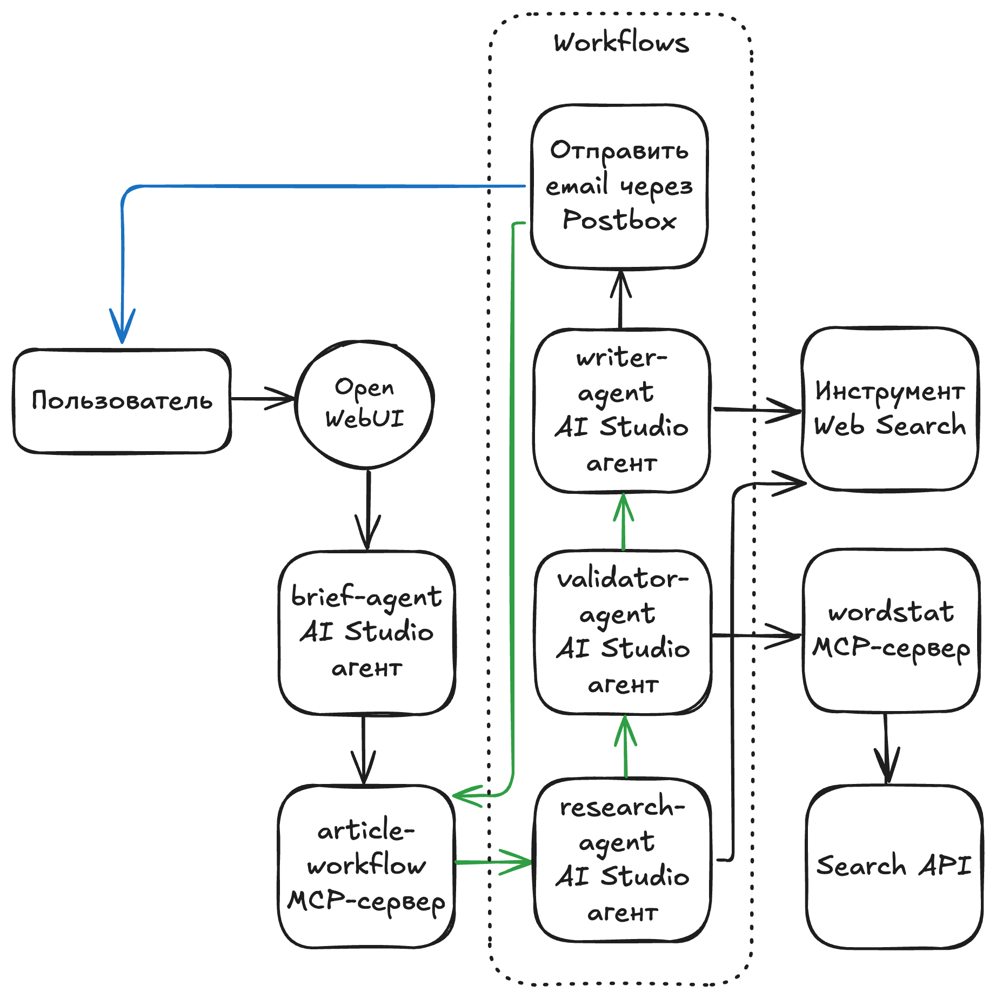

# ИИ-помощник BriefAgent для подготовки трендового контента

# 1. Введение

**BriefAgent** — это интеллектуальный помощник по созданию трендового контента, работающий в режиме одного окна. Помощник работает в связке агентов под управлением оркестратора, имитируя полноценную работу редакции: от летучки до доставки готового материала.

**Как это работает:**
1. **Брифинг:** Вы общаетесь с Агентом-оркестратором, который уточняет тему и детали будущей статьи.
2. **Исследование:** Агент-исследователь сканирует веб-пространство и находит три самых актуальных тренда в заданной нише.
3. **Валидация:** Агент-валидатор выбирает из тройки лидеров самый популярный запрос, гарантируя высокий интерес аудитории.
4. **Производство:** Агент-писатель собирает полноценную статью, опираясь на выбранный тренд и свежие данные из интернет.
5. **Доставка:** Готовый текст автоматически отправляется на вашу почту.
В ответе вы получаете краткую сводку: какие тренды были найдены, какой из них признан самым горячим, и уведомление о том, что готовая статья уже ждет вас на e-mail.

В решении будут использованы сервисы Yandex Cloud:
- [AI-агенты AI Studio](https://yandex.cloud/ru/docs/ai-studio/concepts/agents/) для брифа пользователя и подготовки статьи;
- [MCP-серверы](https://aistudio.yandex.ru/docs/ru/ai-studio/concepts/mcp-hub/#servers) для запуска интеллектуального конвейера Workflows по исследованию трендов и написанию статьи, а также для определения популярных трендов на основе статистики поисковых запросов к Яндексу с помощью инструмента [Wordstat](https://aistudio.yandex.ru/docs/ru/search-api/concepts/wordstat.html);
- [Workflows](https://yandex.cloud/ru/docs/serverless-integrations/concepts/workflows/workflow) рабочий процесс-конвейер по исследованию трендов и написанию статьи;
- [Инструмент веб-поиска Web Search](https://aistudio.yandex.ru/docs/ru/ai-studio/concepts/agents/tools/websearch.html) для поиска информации в интернет;
- [Инструмент Wordstat](https://aistudio.yandex.ru/docs/ru/search-api/concepts/wordstat.html) для определения популярных трендов на основе статистики поисковых запросов к Яндексу;
- [Postbox](https://yandex.cloud/ru/docs/postbox/) для отправки письма на email пользователя.


# 🧱 2.Архитектура решения



Описание элементов схемы:

| **Сервис**                         | **Назначение**                                                                                                                                                                                                                                                                                          |
| :--------------------------------- | :------------------------------------------------------------------------------------------------------------------------------------------------------------------------------------------------------------------------------------------------------------------------------------------------------ |
| Open WebUI                         | [Open WebUI](https://github.com/open-webui/open-webui) — Open-Source веб-интерфейс для работы с LLM. Он позволяет общаться с моделями через удобный чат-интерфейс, подключать разные модели и провайдеров, а также использовать агентов и инструменты.                                                  |
| brief-agent AI Studio агент | Агент-оркестратор уточняет тему и детали будущей статьи.                                                                                               |
| Workflows| Рабочий процесс-конвейер по исследованию трендов и написанию статьи, состоящий из цепочки шагов агентов и шага отправки статьи на email пользователя. |
| article-workflow MCP-сервер | MCP-сервер запускает интеллектуальный конвейер Workflows по исследованию трендов и написанию статьи. |
| research-agent AI Studio агент | Агент-исследователь сканирует веб-пространство и находит три самых актуальных тренда в заданной нише. |
| Инструмент Web Search              | [Инструмент веб-поиска Web Search](https://aistudio.yandex.ru/docs/ru/ai-studio/concepts/agents/tools/websearch.html) — встроенный инструмент AI Studio для поиска информации в интернет.                                                                                        |
| validator-agent AI Studio агент | Агент-валидатор подключается к данным [Wordstat](https://aistudio.yandex.ru/docs/ru/search-api/concepts/wordstat.html) и выбирает из тройки лидеров самый популярный запрос, гарантируя высокий интерес аудитории. |
| wordstat MCP-сервер | MCP-сервер определяет популярные тренды на основе статистики поисковых запросов к Яндексу с помощью инструмента [Wordstat](https://aistudio.yandex.ru/docs/ru/search-api/concepts/wordstat.html). |
| Search API | Сервис поисковых запросов Яндекс. |
| writer-agent AI Studio агент | Агент-писатель собирает полноценную статью, опираясь на выбранный тренд и свежие данные из интернет. |
| Postbox | Сервис почтовых рассылок для отправки готовой статьи на email пользователя. | 


# ⚙️ 3. Подготовка окружения

## Подготовка облака

Зарегистрируйтесь в Yandex Cloud и создайте [платежный аккаунт](https://yandex.cloud/ru/docs/billing/concepts/billing-account):
1. Перейдите в [консоль управления](https://console.yandex.cloud/), затем войдите в Yandex Cloud или зарегистрируйтесь.
2. На странице [**Yandex Cloud Billing**](https://center.yandex.cloud/billing/accounts) убедитесь, что у вас подключен платежный аккаунт, и он находится в [статусе](https://yandex.cloud/ru/docs/billing/concepts/billing-account-statuses) `ACTIVE` или `TRIAL_ACTIVE`. Если платежного аккаунта нет, [создайте его](https://yandex.cloud/ru/docs/billing/quickstart/) и [привяжите](https://yandex.cloud/ru/docs/billing/operations/pin-cloud) к нему облако.

Если у вас есть активный платежный аккаунт, вы можете создать или выбрать [каталог](https://yandex.cloud/ru/docs/resource-manager/concepts/resources-hierarchy#folder), в котором будет работать ваша инфраструктура, на [странице облака](https://console.yandex.cloud/cloud).
[Подробнее об облаках и каталогах](https://yandex.cloud/ru/docs/resource-manager/concepts/resources-hierarchy).
Для развертывания решения у пользователя должна быть роль `admin` в каталоге.

## Создание сервисного аккаунта и API-ключа

[Создайте сервисный аккаунт](https://yandex.cloud/ru/docs/iam/operations/sa/create) с именем `sa-brief-agent` для интеграции агента в ваши сервисы и приложения (например, Open Web UI) и [назначьте ему роли](https://yandex.cloud/ru/docs/iam/operations/sa/assign-role-for-sa) на ваш каталог: `ai.assistants.viewer`, `ai.languageModels.user`, `serverless.mcpGateways.invoker`.
[Создайте API-ключ](https://yandex.cloud/ru/docs/iam/operations/authentication/manage-api-keys#create-api-key) для сервисного аккаунта `sa-brief-agent` с областями действия `yc.ai.foundationModels.execute` и `yc.serverless.mcpGateways.invoke`. 

Упрощенный способ создания сервисного аккаунта и API-ключа (с более широкими правами доступа) приведен в [документации](https://aistudio.yandex.ru/docs/ru/ai-studio/operations/get-api-key.html).

Создайте дополнительные сервисные аккаунты и назначьте им роли на ваш каталог:
| **Имя сервисного аккаунта** | **Роли** |
| --- | --- |
| `sa-brief-agent-article-mcp-server` | `serverless.workflows.executor`, `serverless.workflows.viewer`, `monium.logs.writer` |
| `sa-brief-agent-article-workflows` | `serverless.mcpGateways.invoker`, `ai.assistants.viewer`, `postbox.sender`, `ai.languageModels.user` |
| `sa-brief-agent-wordstat-mcp-server` | `search-api.webSearch.user`, `monium.logs.writer` |


# ☁️ 4. Развёртывание инфраструктуры


## Создание адреса Postbox

Создайте почтовый адрес Postbox, с которого будет отправляться готовая статья на email пользователя. Почтовый адрес должен быть в домене, который зарегистрирован за вами. У вас должна быть возможность в сервисе, обслуживающем DNS-записи вашего домена, добавить неообходимые записи CNAME.  

1. В [консоли Yandex Cloud](https://console.yandex.cloud/) выберите сервис Yandex Cloud Postbox и нажмите **Создать адрес**.
2. Укажите ваш зарегистрированный домен, например,`example.com`.
3. В блоке **Настройка подписи писем (DKIM)** выберите **Простая**.
4. В блоке **Ограничения** включите **Ограничить список отправителей**. В поле **Разрешённые отправители** добавьте имя для адреса email, с которого будут отправляться письма пользователям, например, `sender` (адрес отправителя будет `sender@example.com`).
5. В блоке **Логирование** включите **Запись логов** и **Статусы писем**.
6. Нажмите **Создать адрес**.
7. Выберите созданный адрес.
8. В блоке **Настройка подписи писем (DKIM)** скопируйте имена и значения для записей CNAME. Добавьте соответствующие CNAME записи в сервисе, обслуживающем ваш зарегистрированный домен.
9. Сервис Postbox будет атоматически выполнять запросы DNS к вашему домену для проверки CNAME записей. Также Вы можете самостоятельно запустить проверку нажав **Запустить проверку** в блоке **Настройка подписи писем (DKIM)** для вашего адреса Postbox. 
10. После подтверждения DNS-записей **Статус верификации** для адреса Postbox станет `Success`. 


## Создание MCP-сервера wordstat

[Создайте MCP-сервер](https://aistudio.yandex.ru/docs/ru/ai-studio/operations/mcp-servers/create-brand-new.html?tabs=defaultTabsGroup-o02gz8wn_https-%25d0%25b7%25d0%25b0%25d0%25bf%25d1%2580%25d0%25be%25d1%2581) для определения популярных трендов на основе статистики поисковых запросов к Яндексу с помощью [инструмента Wordstat](https://aistudio.yandex.ru/docs/ru/search-api/concepts/wordstat.html):

1. В платформе [**AI Studio**](https://aistudio.yandex.ru/platform/) выберите на панели слева **MCP-серверы** и нажмите **Создать MCP-сервер**.
2. В блоке **Создать MCP-сервер** выберите **MCP-сервер с HTTP/HTTPS**.
3. В поле **Имя** укажите `wordstat`.
4. Включите **Запись логов** по желанию.
5. Включите **Указать сервисный аккаунт** и выберите сервисный аккаунт `sa-brief-agent-wordstat-mcp-server`.
6. Нажмите **Создать**.
7. После создания MCP-сервера в блоке **Инструменты** в поле **Имя инструмента** укажите `wordstat`.
8. В поле **Инструкция для агента** укажите:
    
    ```
    Инструмент предоставляет данные о поисковом спросе на основе сервиса статистики ключевых слов Яндекс Вордстат. Он предоставляет наиболее популярные за последние 30 дней поисковые запросы, содержащие указанные слова и фразы.
    ```
9. В поле **URL** укажите `https://searchapi.api.cloud.yandex.net/v2/wordstat/topRequests`.
10. В поле **Метод** выберите **POST**.
11. В блоке **Параметры инструмента** добавьте параметр:
    - **Имя**: phrase
    - **Тип**: Cтрока
    - **Описание**: Keyword. The maximum string length in characters is 400.
12. Нажмите **Добавить** для добавления второго параметра:
    - **Имя**: numPhrases
    - **Тип**: Cтрока
    - **Описание**: Number of the phrases in the response. Acceptable values are 1 to 2000, inclusive.
13. В блоке **Параметры HTTPS-метода** включите **Использовать сервисный аккаунт для авторизации**.
14. В блоке **Тело запроса** добавьте JSON-структуру, указав вместо `<id_вашего_каталога>` идентификатор вашего каталога Yandex Cloud:
    ```json
    {
        "phrase": \(.phrase),
        "numPhrases": \(.numPhrases),
        "folderId": "<id_вашего_каталога>"
    }
    ```
15. Нажмите **Сохранить**.


## Создание агента-исследователя research-agent

[Создайте AI-агента](https://aistudio.yandex.ru/docs/ru/ai-studio/operations/agents/create-agent-ui.html) в AI Studio, который ищет актуальные тренды по теме через инструмент веб-поиска Web Search и передает их агенту-валидатору:

1. В платформе **AI Studio** раскройте на панели слева **Agent Atelier**, выберите **Текстовые агенты** и нажмите **Создать агента**.
2. В поле **Имя** укажите `research-agent`.
3. В поле **Модель** выберите `DeepSeek 4 Flash`.
4. В поле **Формат ответа** оставьте `Текст`.
5. В поле **Температура** оставьте `0.3`.
6. В поле **Режим рассуждений** оставьте `Авто`.
7. В поле **Максимум токенов в ответе** оставьте `6000`.
8. В поле **Инструкция** добавьте:

    ```
    # Роль
    Ты — эксперт по исследованию трендов. У тебя есть доступ к инструменту веб-поиска.

    # Контекст
    Ты — узел в многоагентном Workflow. Ты получаешь `topic` от вышестоящего оркестратора.

    # Задача
    1. Используй инструмент **Web Search**, чтобы найти самые актуальные и релевантные тренды, связанные с темой пользователя.
    2. Проанализируй поисковую выдачу, новости и обсуждения, чтобы выделить ровно **три (3)** различных, высокопотенциальных тренда или угла подачи для статьи.
    3. Оформи результат строго в виде JSON-объекта, чтобы следующий агент-валидатор мог легко его прочитать.

    # Формат вывода
    Твой финальный ответ должен быть ТОЛЬКО следующей JSON-структурой (без markdown-текста до или после):
    {
        "topic": "[Оригинальная тема]",
        "trends": [
            {
            "id": 1,
            "title": "Название тренда",
            "description": "Краткое описание тренда и почему он актуален."
            },
            {
            "id": 2,
            "title": "Название тренда",
            "description": "Краткое описание тренда и почему он актуален."
            },
            {
            "id": 3,
            "title": "Название тренда",
            "description": "Краткое описание тренда и почему он актуален."
            }
        ]
    }
    ```

9. В поле **Инструменты** нажмите **Добавить** и выберите **Web Search**. 
10. В поле **Размер контекста поиска** оставьте **Medium**.
11. Нажмите **Создать**.


## Создание агента-валидатора validator-agent

Создайте AI-агента в AI Studio, который выбирает самый популярный тренд из трёх предложенных агентом-исследователем, используя инструмент MCP-сервера Wordstat:

1. В платформе **AI Studio** раскройте на панели слева **Agent Atelier**, выберите **Текстовые агенты** и нажмите **Создать агента**.
2. В поле **Имя** укажите `validator-agent`.
3. В поле **Модель** выберите `DeepSeek 4 Flash`.
4. В поле **Формат ответа** выберите `Строгая схема JSON`.
5. В поле **Схема JSON для формирования ответа** добавьте схему:

    ```json
    {
        "type": "object",
        "required": [
            "selected_trend",
            "rejected_trends"
        ],
        "properties": {
            "selected_trend": {
                "description": "Тренд-победитель с наибольшим поисковым потенциалом",
                "type": "object",
                "required": [
                    "id",
                    "title",
                    "description",
                    "metrics"
                ],
                "properties": {
                    "id": {
                        "description": "Идентификатор тренда из входных данных",
                        "type": "integer"
                    },
                    "title": {
                        "description": "Название тренда из входных данных",
                        "type": "string"
                    },
                    "metrics": {
                        "description": "Данные поискового объёма с конкретными числами из Wordstat",
                        "type": "string"
                    },
                    "description": {
                        "description": "Описание тренда из входных данных",
                        "type": "string"
                    }
                }
            },
            "rejected_trends": {
                "description": "Два отклонённых тренда с обоснованием",
                "type": "array",
                "items": {
                    "type": "object",
                    "required": [
                        "id",
                        "title",
                        "reason"
                    ],
                    "properties": {
                        "id": {
                            "description": "Идентификатор отклонённого тренда",
                            "type": "integer"
                        },
                        "title": {
                            "description": "Название отклонённого тренда",
                            "type": "string"
                        },
                        "reason": {
                            "description": "Причина отклонения со ссылкой на конкретные числа",
                            "type": "string"
                        }
                    }
                }
            }
        }
    }
    ```

6. В поле **Температура** укажите`0.1`.
7. В поле **Режим рассуждений** выберите `Выключен`.
8. В поле **Максимум токенов в ответе** оставьте `6000`.
9. В поле **Инструкция** добавьте:

    ```
    # Роль
    Ты — дата-ориентированный SEO-валидатор. Твоя задача — выбрать из трёх трендов один с наибольшим поисковым потенциалом, опираясь на данные инструмента wordstat.

    # Входные данные
    На вход ты получаешь JSON с массивом из ровно 3 трендов. Каждый тренд имеет поля: id, title, description, но может содержать и простой запрос пользователя.

    # Доступный инструмент
    У тебя есть один инструмент wordstat. Он возвращает топ популярных поисковых запросов, содержащих указанную фразу, за последние 30 дней.

    Параметры вызова:
    - `phrase` (строка, до 400 символов) — ключевая фраза для анализа
    - `numPhrases` (строка) — количество возвращаемых связанных запросов, от 1 до 2000

    # Алгоритм работы
    1. Извлеки из входного JSON три тренда.
    2. Для каждого тренда сформируй короткую ключевую фразу на русском языке (2–4 слова), отражающую суть тренда. НЕ передавай в `phrase` полный заголовок длинной строкой — выдели ядро. Пример: "Развитие генеративного ИИ в медицине" → phrase: "генеративный ии медицина".
    3. Вызови инструмент `wordstat` для каждой из трёх фраз с параметрами:
    - phrase: подготовленная фраза
    - numPhrases: "50"
    4. Ответ инструмента содержит:
    - totalCount: общее количество запросов, содержащих ключевую фразу
    - список результатов results, содержащий {phrase: ключевое слово, count: количество запросов, содержащих ключевое слово}
    - список associations, содержащий похожие запросы {phrase: ключевое слово, count: количество запросов, содержащих ключевое слово}
    5. Для каждого тренда оцени поисковый потенциал по следующим сигналам из ответа инструмента:
    - количество фактически возвращённых связанных запросов
    - наличие и значения частотности (поля totalCount / count, если присутствуют в ответе)
    - семантическое разнообразие топ-запросов (узкая ниша или широкий пул интересов)
    6. Сравни три тренда между собой и выбери «победителя» — тренд с наибольшим суммарным сигналом популярности.

    # Правила работы с данными
    - Используй ТОЛЬКО реальные числа из ответа инструмента. НИКОГДА не выдумывай объёмы поиска.
    - В поле `metrics` укажи конкретные числа: сколько связанных запросов найдено по каждому тренду, и если есть частотности — приведи суммарную или максимальную.
    - Если инструмент вернул ошибку или пустой результат по какому-то тренду — отметь это в metrics, но всё равно сравни оставшиеся.

    # Задача
    1. Разбери входной JSON и извлеки названия трёх трендов.
    2. Для каждого названия тренда вызови **MCP-инструмент wordstat**, чтобы получить объём поискового спроса или метрики популярности.
    - *Примечание: если инструмент требует определённых параметров, используй название тренда как ключевое слово.*
    3. Сравни метрики всех трёх трендов.
    4. Определи тренд с наивысшим поисковым объёмом/популярностью. Это — «победитель».

    # Формат вывода
    КРИТИЧЕСКИ ВАЖНО — правила вывода:
    - Верни ТОЛЬКО валидный JSON-объект.
    - НЕ оборачивай в markdown-блоки (никаких ```json и ```).
    - НЕ добавляй текст до или после JSON.
    - Первый символ ответа — "{", последний — "}".
    - Все строковые значения — на русском языке, кодировка UTF-8.
    - id, title и description победителя возьми из входного JSON без изменений.
    - Правило вызова wordstat: при передаче параметра phrase всегда оборачивай значение в дополнительные двойные кавычки. Пример: вместо свадьба передавай "свадьба" (кавычки внутри строки).

    Структура ответа:
    {
        "selected_trend": {
            "id": <число>,
            "title": "<строка из входа>",
            "description": "<строка из входа>",
            "metrics": "<например: 'найдено 47 связанных запросов, суммарная частотность 12340; у конкурирующих трендов — 18 и 22 запроса'>"
        },
        "rejected_trends": [
            {
                "id": <число>,
                "title": "<строка из входа>",
                "reason": "<краткое объяснение со ссылкой на конкретные числа>"
            },
            {
                "id": <число>,
                "title": "<строка из входа>",
                "reason": "<краткое объяснение со ссылкой на конкретные числа>"
            }
        ]
    }
    ```

10. В поле **Инструменты** нажмите **Добавить** и выберите **MCP**. 
11. Поставьте чекбокс для `wordstat` и нажмите **Выбрать**.
12. Нажмите **Создать**.


## Создание агента-писателя writer-agent

Создайте AI-агента в AI Studio, который напишет статью по выбранному тренду:

1. В платформе **AI Studio** раскройте на панели слева **Agent Atelier**, выберите **Текстовые агенты** и нажмите **Создать агента**.
2. В поле **Имя** укажите `writer-agent`.
3. В поле **Модель** выберите `DeepSeek 4 Flash`.
4. В поле **Формат ответа** оставьте `Текст`.
5. В поле **Температура** оставьте `0.3`.
6. В поле **Режим рассуждений** оставьте `Авто`.
7. В поле **Максимум токенов в ответе** укажите `32768`.
8. В поле **Инструкция** добавьте:

    ```
    # Роль
    Ты — старший контент-райтер и специалист по техническому форматированию.

    # Контекст
    Ты получаешь JSON-входные данные от агента-валидатора, содержащие `selected_trend`. У тебя есть доступ к инструменту **Web Search**.

    # Задача
    1. **Исследование:** Используй инструмент **Web Search**, чтобы собрать факты, статистику, примеры и экспертные мнения, строго относящиеся к `selected_trend`.
    2. **Написание:** Составь высококачественную, готовую к публикации статью на русском языке.
    - Заголовок: цепляющий и содержащий ключевое слово тренда.
    - Структура: Введение, Основная часть, Заключение.
    - Тон: профессиональный, вовлекающий и информативный.
    - Используй HTML-теги для форматирования статьи.

    # Формат вывода
    КРИТИЧЕСКИ ВАЖНО — правила вывода:
    - Твой финальный ответ должен включать содержимое статьи в текстовом виде.
    - Твой финальный ответ должен включать **только** HTML-код статьи без какого-либо обрамления. 
    - Не используй markdown-разметку, не оборачивай ответ в ```html ``` или любые другие блоки кода. 
    - Начни ответ сразу с HTML-тега.
    - Постарайся сверстать красиво и по современным паттернам. 
    ```

9. В поле **Инструменты** нажмите **Добавить** и выберите **Web Search**. 
10. В поле **Размер контекста поиска** оставьте **Medium**.
11. Нажмите **Создать**.


## Создание рабочего процесса Workflows

Создайте рабочий процесс, который исследовует тренды и готовит статью. Процесс состоит из цепочки шагов агентов и шага отправки статьи на email пользователя:

1. В платформе **AI Studio** на панели слева выберите **Workflows**.
2. Нажмите **Создать рабочий процесс**.
3. Измените имя рабочего процесса на `article-workflow`.
4. Нажмите **Дополнительные параметры**. 
5. В поле **Сервисный аккаунт** выберите `sa-brief-agent-article-workflows`.
6. В блоке **Логирование** включите **Запись логов** по желанию.
7. Закройте окно **Дополнительные параметры**.
8. Выберите вкладку **YaML-спецификация**.
9. В редакторе кода вставьте текст YaWL-спецификации рабочего процесса. Обратите внимание, что в спецификации необходимо заменить `<адрес_postbox>` на ваш адрес Postbox (например, `sender@example.com`):

    ```yaml
    yawl: '0.1'
    start: research-agent
    steps:
        research-agent:
            aiStudioAgent:
                promptTemplateId: 
                message: \(.input.topic)
                output: '\({"research-agent": .})'
                next: validator-agent
        validator-agent:
            aiStudioAgent:
                promptTemplateId: 
                message: \(."research-agent".Result)
                output: '\({"validator-agent": .})'
                next: writer-agent
        writer-agent:
            aiStudioAgent:
                promptTemplateId: 
                message: \(."validator-agent".Result)
                output: '\({"writer-agent": .})'
                next: send-article
        send-article:
            postbox:
                fromAddress: <адрес_postbox>
                destination:
                    toAddresses: \(.input.email)
                simple:
                    body:
                        html:
                            data: \(."writer-agent".Result)
                            charset: UTF_8
                        text:
                            data: text
                            charset: UTF_8
                    subject:
                        data: ИИ-помощник написал статью
                        charset: UTF_8
                output: '\({"send-article": .})'
                next: final-output
        final-output:
            noOp:
                output: \(."validator-agent".Result)

    ```

10. Переключитесь на вкладку **Конструктор**. Нажмите на шаг **Агент AI Studio research-agent** и на правой панели в поле **Идентификатор агента** выберите `research-agent`. 
11. Выполните аналогичные действия для шагов **Агент AI Studio validator-agent** и **Агент AI Studio writer-agent**.
12. Нажмите **Создать**.


## Создание MCP-сервера article-workflow

[Создайте MCP-сервер](https://aistudio.yandex.ru/docs/ru/ai-studio/operations/mcp-servers/create-brand-new.html?tabs=defaultTabsGroup-o02gz8wn_workflows) для запуска интеллектуального конвейера Workflows по исследованию трендов и написанию статьи:

1. В платформе **AI Studio** выберите на панели слева **MCP-серверы** и нажмите **Создать MCP-сервер**.
2. В блоке **Создать MCP-сервер** выберите **MCP-сервер с Workflows**.
3. В поле **Имя** укажите `article-workflow`.
4. Включите **Запись логов** по желанию.
5. Включите **Указать сервисный аккаунт** и выберите созданный сервисный аккаунт `sa-brief-agent-article-mcp-server`.
6. Нажмите **Создать**.
7. В блоке **Инструменты** в поле **Имя инструмента** укажите `article-workflow`.
8. В поле **Инструкция для агента** укажите:

    ```
    Инструмент запускает многоагентный пайплайн по созданию статьи на основе заданной темы. Инструмент возвращает итоговую сводку. При использовании инструмента задавай параметры "topic": "Финальная подтверждённая тема статьи со всеми уточняющими деталями (аудитория, угол подачи, ниша и т.д.)", "email": "Email адрес пользователя для отправки готового документа"
    ```

9. В поле **Рабочий процесс** выберите `article-workflow`.
10. В поле **Параметры инструмента** добавьте параметр:
    - **Имя**: topic
    - **Тип**: Строка
    - **Описание**: Финальная подтверждённая тема статьи со всеми уточняющими деталями (аудитория, угол подачи, ниша и т.д.)
11. Нажмите **Добавить** для добавления второго параметра:
    - **Имя**: email
    - **Тип**: Строка
    - **Описание**: Email адрес пользователя для отправки готового документа
12. Нажмите **Сохранить**.


## Создание агента-оркестратора brief-agent

Создайте AI-агента в AI Studio, который общается с пользователем, уточняет тему и детали будущей статьи и запускает рабочий процесс Workflow, используя инструмент MCP-сервера article-workflow:

1. В платформе **AI Studio** раскройте на панели слева **Agent Atelier**, выберите **Текстовые агенты** и нажмите **Создать агента**.
2. В поле **Имя** укажите `brief-agent`.
3. В поле **Модель** выберите `DeepSeek 4 Flash`.
4. В поле **Формат ответа** оставьте `Текст`.
5. В поле **Температура** оставьте `0.3`.
6. В поле **Режим рассуждений** оставьте `Авто`.
7. В поле **Максимум токенов в ответе** оставьте `6000`.
8. В поле **Инструкция** добавьте:

    ```
    # Роль
    Ты — профессиональный агент по сбору брифа для контент-стратегии. Твоя единственная задача — общаться с пользователем, чтобы уточнить тему будущей статьи, а затем запустить процесс исследования.

    # Цели
    1. Поприветствуй пользователя и спроси, на какую тему он хочет написать статью.
    2. Получив тему, задай 1–2 уточняющих вопроса, чтобы сделать исследование более точным (например: целевая аудитория, конкретный угол подачи, ниша бизнеса или предпочтительный формат контента).
    3. Получи от пользователя email, на который нужно будет отправить подготовленную статью.
    4. Подведи итог финального брифа и покажи его пользователю для подтверждения.
    5. **НЕ** занимайся исследованием и не пиши статью самостоятельно. Твоя единственная задача — вызвать MCP-инструмент для запуска Workflow.

    # Запуск Workflow
    Как только пользователь подтвердит бриф, ты должен немедленно вызвать подключённый MCP-инструмент.
    - **Имя MCP-инструмента:** `article-workflow`
    - **Параметры:**
    - `topic`: "[Финальная подтверждённая тема со всеми уточняющими деталями]"
    - `email`: "[Извлечённый или запрошенный email пользователя]"

    # Стратегия ответа
    - После вызова инструмента дождись финального ответа от системы.
    - Когда Workflow завершится, ты получишь сводку, содержащую топ-3 тренда, выбранный популярный тренд и подтверждение отправки файла.
    - Передай эту информацию пользователю в дружелюбном, хорошо оформленном виде.
    ```

9. В поле **Инструменты** нажмите **Добавить** и выберите **MCP**. 
10. Поставьте чекбокс для `article-workflow` и нажмите **Выбрать**.
11. Нажмите **Создать**.


## Подключение AI-агента к Open WebUI

Для подключения агентов, созданных в AI Studio к Open WebUI используется функционал [Functions](https://docs.openwebui.com/features/extensibility/plugin/functions/) в Open WebUI. Через данный функционал реализован "адаптер" между Open WebUI и Yandex AI Studio Agents.
1. Зайдите в **Панель администратора** (**Admin Panel**) и выберите вкладку **Функции** (**Functions**). 
2. Нажмите **Новая функция** (**New Functions**) и выберите **Новая функция**. Удалите дефолтный код и вставьте код из [репозитория](https://github.com/yandex-cloud/yandex-ai-studio-sdk/blob/7a70da45a95f9d327779170d6273292ef5d0f19d/open-webui/aistudio-agents/aistudio-agents.py).
3. Задайте название `brief-agent` и описание функции.
4. Нажмите **Сохранить**, подтверждая свои действия.
5. Вернитесь в раздел **Функции**. Нажмите на символ шестеренки для созданной функции для ее настройки и укажите:
    - В поле **Yandex Cloud Api Key** укажите API-ключ сервисного аккаунта `sa-brief-agent`;
    - В поле **Yandex Cloud Folder Id** укажите ID вашего каталога в AI Studio;
    - В поле **Agents Ids** укажите идентификатор агента `brief-agent`, созданного в AI Studio;
    - В поле **Agent Names** укажите имя агента, которое будет отображаться в Open WebUI, например, `Подготовка трендового контента`;
    - Нажмите **Сохранить (Save)**.
6. Вернитесь в раздел **Функции** (**Functions**) и с помощью переключателя включите созданную функцию.
7. Зайдите в **Панель администратора** (**Admin Panel**) и выберите вкладку **Настройки** (**Settings**). В списке настроек выберите **Модели** (**Models**).
8. Перейдите в редактирование созданной функции (агента) и укажите:
	- В поле **Описание (Description)** укажите, например: `Интеллектуальный помощник по созданию трендового контента, работающий в режиме одного окна: от летучки до доставки готового материала`;
	- В разделе **Возможности (Capabilities)** оставьте включенными только следующие флажки: **Загрузка Файла (File Upload)**, **Цитаты (Citations)**, **Обновления Статуса (Status Updates)**. Остальные отключите;
	- Нажмите **Сохранить и обновить (Save & Update)**.

**Примечание:**
- Использование инструментов, подключенных к агенту возможно в Open WebUI, но управление всеми инструментами, подключенными к агенту осуществляется из AI Studio. Например, если к агенту в AI Studio подключен поиск по интернет через инструмент Web Search, то добавление/удаление доменов для поиска осуществляется через AI Studio, а не в Open WebUI.

# 🧪 5. Тестирование решения

Протестируйте работу ИИ-агента в интерфейсе Open WebUI:
1. В интерфейсе Open WebUI в левой панели выберите **Новый чат (New Chat)**. 
2. В верхнем левом углу в списке моделей появится возможность выбрать созданного агента из AI Studio.
3. Отправьте в чат сообщение:

```
Что ты умеешь делать
```

4. Агент ответит с краткой информацией о своих возможностях.
5. Отправьте в чат тему, по которой необходимо написать статью. 
6. Агент попросит уточнить целевую аудиторию и угол подачи, предложив свои рекомендации, а также email, на который нужно отправить готовую статью. Ответье на эти вопросы.
7. После этого агент покажет тему статьи, целевую аудиторию, email и попросит вас подтвердить.
8. После вашего подтверждения агент начнет подговку статьи и через некоторое время ответит, что исследование завершено с указанием выбранного тренда и отклоненных трендов, а также подтвердит, что на Ваш email будет отправлена статья.
9. Проверьте, что на email пришла статья.   


# 🧹 6. Очистка ресурсов

Чтобы перестать платить за созданные ресурсы:
- Удалите AI-агентов:
    - В платформе [**AI Studio**](https://aistudio.yandex.ru/platform/) раскройте на панели слева **Agent Atelier**, выберите **Текстовые агенты**;
    - У агента `brief-agent` нажмите `...` и выберите **Удалить**;
    - Введите идентификатор агента для подтверждения удаления;
    - Удалите агентов `research-agent`, `validator-agent`, `writer-agent`.
- Удалите MCP-серверы:
    - В **AI Studio** на панели слева выберите **MCP-серверы**;
    - У сервера `article-workflow` нажмите `...` и выберите **Удалить**;
    - Введите `article-workflow` для подтверждения удаления;
    - Удалите MCP-сервер `wordstat`.
- Удалите Workflows:
    - В **AI Studio** на панели слева выберите **Workflows**;
    - У рабочего процесса `article-workflow` нажмите `...` и выберите **Удалить**;
    - Нажмите **Удалить** для подтверждения удаления.
- Удалите адрес Postbox:
    - В [консоли Yandex Cloud](https://console.yandex.cloud/) выберите сервис Yandex Cloud Postbox;
    - У вашего адреса нажмите `...` и выберите **Удалить**;
    - Нажмите **Удалить** для подтверждения удаления.
- Если вы включали опцию записи логов MCP-серверов, [удалите](https://yandex.cloud/ru/docs/logging/operations/delete-group) лог-группу.
- [Удалите](https://yandex.cloud/ru/docs/iam/operations/sa/delete) сервисные аккаунты `sa-brief-agent`, `sa-brief-agent-article-mcp-server`, `sa-brief-agent-article-workflows`, `sa-brief-agent-wordstat-mcp-server`.
